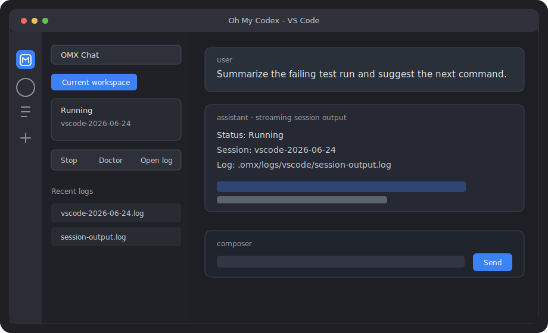

# Oh My Codex VS Code Extension

The Oh My Codex VS Code extension is the editor-facing UI for OMX. It gives a
workspace a local Chat surface for launching direct OMX sessions, watching
session output, reopening recent logs, and running quick health checks without
switching to a terminal pane.



## What It Does

- Starts and resumes direct OMX sessions from VS Code commands.
- Uses Chat as the primary input surface for prompts.
- Streams direct-session stdout and stderr into the assistant response.
- Stores local chat transcripts under the active workspace.
- Lists recent OMX/VS Code logs and opens only logs that resolve inside the
  active workspace.
- Runs `omx doctor` from the extension command surface.

## Install From A Checkout

This package currently targets local checkout and contributor workflows. It is
not yet published as a stable Marketplace extension.

Build the repository root first so the extension can load the shared VS Code
core API from `dist/vscode/index.js`:

```bash
npm run build
```

Then install and verify the extension package:

```bash
cd packages/vscode-extension
npm install
npm test
```

To install a local VSIX into VS Code:

```bash
cd packages/vscode-extension
npx @vscode/vsce package
code --install-extension ./oh-my-codex-vscode-*.vsix --force
```

Reload the VS Code window after installing or replacing a local VSIX.

## Run From Source

For extension development, run the TypeScript compiler in watch mode:

```bash
cd packages/vscode-extension
npm install
npm run watch
```

Open the repository in VS Code and launch an Extension Development Host from the
extension package. The extension expects a built OMX core API. If the active
workspace is not the repository root, set `omx.coreModulePath` to an absolute
path for `dist/vscode/index.js`.

## Configuration

Supported settings:

- `omx.command`: Optional OMX executable path or command. When empty, the
  extension prefers the active workspace's `dist/cli/omx.js`, then falls back to
  `omx` on `PATH`.
- `omx.defaultArgs`: Default arguments appended to direct sessions.
- `omx.extraPath`: Extra directories prepended to `PATH` when launching OMX.
- `omx.coreModulePath`: Optional absolute path to the compiled OMX VS Code core
  module.
- `omx.confirmDangerousLaunches`: Require confirmation before launch arguments
  include approval-bypass flags.

Example workspace setting:

```json
{
  "omx.coreModulePath": "/path/to/oh-my-codex/dist/vscode/index.js",
  "omx.defaultArgs": ["--model", "gpt-5-codex"]
}
```

## Data And Logs

The extension writes local VS Code chat state under:

```text
.omx/vscode/conversations/
```

Session and extension logs stay in the repository's OMX log locations. Log open
actions resolve real paths before opening a file, so symlinked or direct paths
outside the active workspace are rejected.

## Current Status

The extension is an MVP-quality package in the repository. The current surface
is intentionally narrow: Chat, direct session lifecycle commands, streamed
session output, local transcripts, recent log access, and a doctor command.

The package is suitable for local development and dogfooding. It still needs
release packaging, more polished navigation, and broader UX hardening before it
should be treated as a stable end-user extension.

## Roadmap

- Make Chat the default Activity Bar entry for everyday OMX work.
- Package the extension with a reliable bundled or discoverable OMX core API.
- Add richer session lifecycle controls, including clearer resume and stop
  states.
- Expand log review into a focused Log Explorer with filtering and scoped
  previews.
- Add configuration UI for command, model, default args, and environment setup.
- Increase integration coverage for webview state, extension activation, and
  local VSIX packaging.

## Development Notes

Do not commit generated artifacts such as `dist/`, `node_modules/`, or
`*.vsix`. Keep the extension code thin and reuse the shared root `src/vscode`
APIs for launch args, PATH resolution, dangerous flag checks, session launches,
and redacted logs.
